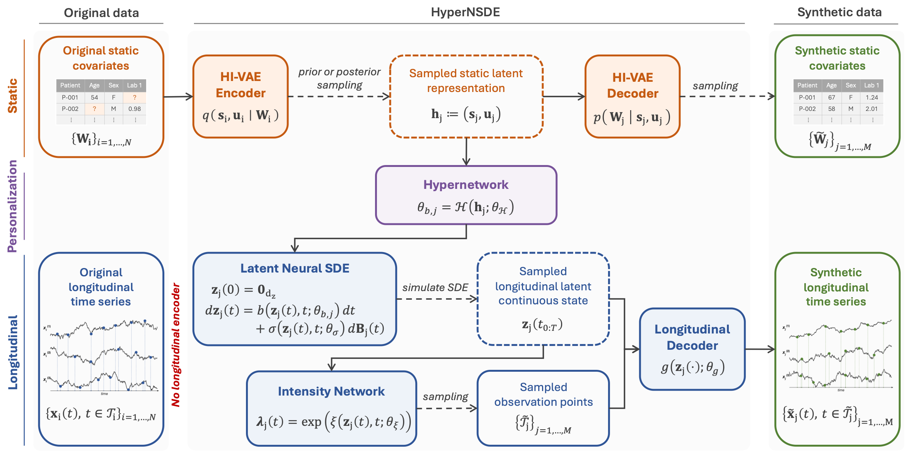

<div align="center">

# HyperNSDE 

</div>

Official implementation of the following paper:

> Perrine Chassat and Agathe Guilloux. **HyperNSDE: Personalized Neural SDEs for Joint Static–Longitudinal Clinical Data Generation.** *Advances in Neural Information Processing Systems (NeurIPS)*, 2026. [Paper](https://arxiv.org/abs/2610.07383)

HyperNSDE is a continuous-time generative model for synthetic clinical data that jointly models static covariates, irregular longitudinal trajectories, and informative observation times. A hypernetwork conditions a latent Neural Stochastic Differential Equation (SDE) on static patient representations, allowing baseline characteristics to shape trajectory evolution beyond the initial condition. Observation times are modeled through a latent-state-dependent intensity process, and training uses a non-adversarial signature-kernel objective.



*Overview of the HyperNSDE architecture.*

## Installation

### Prerequisites

The installation requires [Conda](https://docs.conda.io/en/latest/).

### Setup

Clone the repository and create the Conda environment:

```bash
git clone https://github.com/perrinechassat/HyperNSDE.git
cd HyperNSDE
git submodule update --init --recursive
bash install_env_conda.sh
conda activate env_synth_longi
```

## Project Structure
```bash
HyperNSDE/
├── src/
│   ├── modules/                  # Model building blocks
│   ├── evaluation/               # Evaluation metrics
│   ├── build_module.py           # Model assembly
│   ├── generative_model.py       # Main generative model class
│   ├── losses.py                 # Loss functions
│   ├── hyperopt.py               # Hyperparameter optimization utilities
│   ├── parser.py                 # Argument parser
│   └── utils.py                  # Utility functions
│
├── data_loader/                  # Data loading and preprocessing
│
├── datasets/
│   ├── Simu_OU/                  # Simulated Ornstein-Uhlenbeck datasets
│   ├── VELOUR/                   # Placeholder for VELOUR dataset
│   └── PPMI/                     # Placeholder for PPMI dataset
│
├── experiments/
│   ├── simulations/              # Simulation experiments and Monte Carlo studies
│   └── real_datasets/            # Experiments on real datasets
│
├── benchmark/
│   ├── rtsgan/                   # RTSGAN baseline
│   ├── multiNODEs/               # MultiNODEs baseline
│   └── DGBFGP/                   # DGBFGP baseline
│
├── visualization_results/        # Visualization and evaluation scripts
│
├── main.py                       # Main training entry point
├── run_optuna_hyperopt.py        # Hyperparameter optimization entry point
├── environment.yml               # Conda environment specification
└── install_env_conda.sh          # Environment installation script
```

## Data

The repository includes simulated data used for the synthetic experiments.

Real-world datasets are not included in this repository due to access restrictions. The corresponding folders are provided only as placeholders to indicate the expected structure.

## Usage
### Train a model

```bash
python main.py
```

### Run hyperparameter optimization

```bash
python run_optuna_hyperopt.py
```

Additional experiment-specific configurations are available in:

```bash
experiments/
```

## Reproducibility

The code is organized to reproduce the simulation and real-data experiments described in the paper. Configuration files and experiment scripts are provided in the experiments/ directory.

## Citation

If you use HyperNSDE in your research, please cite:

```bibtex
@inproceedings{chassat2026hypernsde,
  title     = {{HyperNSDE}: Personalized Neural {SDEs} for Joint Static--Longitudinal Clinical Data Generation},
  author    = {Chassat, Perrine and Guilloux, Agathe},
  booktitle = {Advances in Neural Information Processing Systems},
  year      = {2026}
}
```
